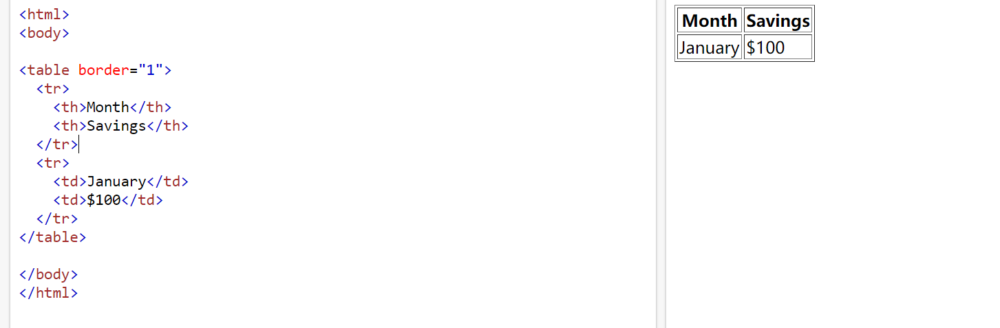
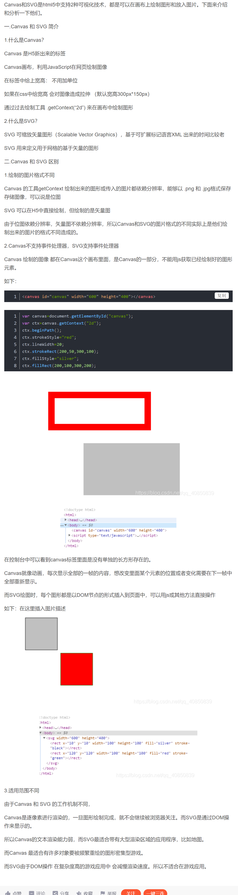

<a name="summary">hh</a>

[TOC]


# 总结

# 一、计网

# 1.HTTP（应用层）

- HTTP 是基于 TCP/IP（传输控制协议/因特网互联协议，又名网络通讯协议，是 Internet 最基本的协议）的关于数据在万维网中如何通信的协议。

- HTTP 是超文本传输协议的缩写，它用于传送 WWW 方式的数据。

- HTTP 协议采用了请求/响应模型。

- HTTP协议工作于客户端-服务端架构为上。浏览器作为HTTP客户端通过URL向HTTP服务端即WEB服务器发送所有请求。Web服务器根据接收到的请求后，向客户端发送响应信息。

  

[跳转到首页](#summary)

## 1.2 HTTP请求方法

`http/1.1`规定了以下请求方法（注意，都是大写）：

- GET：通常用来获取资源
- HEAD：获取资源的元信息
- POST：提交数据，即上传数据
- PUT：修改数据
- DELETE：删除资源(几乎用不到)
- CONNECT：建立连接隧道，用于代理服务器
- OPTIONS：列出可对资源实行的请求方法，用来跨域请求
- TRACE：追踪请求-响应的传输路径

[跳转到首页](#summary)

## 1.3 get和post区别

首先最直观的是语义上的区别。

而后又有这样一些具体的差别：

- 从**缓存**的角度，GET 请求会被浏览器主动缓存下来，留下历史记录，而 POST 默认不会，除非手动设置

- 从**编码**的角度，GET 只能进行 URL 编码，只能接收 ASCII 字符，而 POST 没有限制

- 从**参数**的角度，GET 一般放在 URL 中，因此不安全，POST 放在请求体中，更适合传输敏感信息

- 从**幂等性**的角度，`GET`是**幂等**的，而`POST`不是。(**幂等**表示执行相同的操作，结果也是相同的)

- 从**TCP**的角度，GET 请求会把请求报文一次性发出去，而 POST 会分为两个 TCP 数据包，首先发 header 部分，如果服务器响应 100(continue)， 然后发 body 部分。(**火狐**浏览器除外，它的 POST 请求只发一个 TCP 包) 

- GET 在浏览器回退时是无害的，而 POST 会再次提交请求。

- GET 产生的 URL 地址可以被 Bookmark，而 POST 不可以。

[跳转到首页](#summary)

## 1.4 options 方法有什么用？

- OPTIONS 请求与 HEAD 类似，一般也是用于客户端查看服务器的性能。
- 这个方法会请求服务器返回该资源所支持的所有 HTTP 请求方法，该方法会用'*'来代替资源名称，向服务器发送 OPTIONS 请求，可以测试服务器功能是否正常。
- JS 的 XMLHttpRequest对象进行 CORS 跨域资源共享时，对于复杂请求，就是使用 OPTIONS 方法发送嗅探请求，以判断是否有对指定资源的访问权限。

[跳转到首页](#summary)

## 1.5如何理解 URI？

**URI**, 全称为(Uniform Resource Identifier), 也就是**统一资源标识符**，它的作用很简单，就是区分互联网上不同的资源。

但是，它并不是我们常说的`网址`, 网址指的是`URL`, 实际上`URI`包含了`URN`和`URL`两个部分，由于 URL 过于普及，就默认将 URI 视为 URL 了。

[跳转到首页](#summary)

## 1.6 http状态码

RFC 规定 HTTP 的状态码为**三位数**，被分为五类：

- **1xx**： 表示目前是协议处理的中间状态，还需要后续操作
- **2xx**： 表示成功状态
- **3xx**： 重定向状态，资源位置发生变动，需要重新请求
- **4xx**： 请求报文有误 / 客户端错误
- **5xx**： 服务器端发生错误

———————————————————————————————————

### 1xx

**100 Continue** 继续，一般在发送 post 请求时，已发送了 http header 之后服务端将返回此信息，表示确认，之后发送具体参数信息。

**101 Switching Protocols**。在`HTTP`升级为`WebSocket`的时候，如果服务器同意变更，就会发送状态码 101。

### 2xx

**200 OK ** 是见得最多的成功状态码。通常在响应体中放有数据。

**201 Created**  请求成功并且服务器创建了新的资源 。

**202 Accepted**  服务器已接受请求，但尚未处理 。

**204 No Content ** 含义与 200 相同，但响应头后没有 body 数据。

**206 Partial Content ** 顾名思义，表示部分内容，它的使用场景为 HTTP 分块下载和断点续传，当然也会带上相应的响应头字段`Content-Range`。

### 3xx

**301 Moved Permanently ** 即永久重定向，对应着  **302 Found**，即临时重定向。

比如你的网站从 HTTP 升级到了 HTTPS 了，以前的站点再也不用了，应当返回`301`，这个时候浏览器默认会做缓存优化，在第二次访问的时候自动访问重定向的那个地址。

而如果只是暂时不可用，那么直接返回`302`即可，和`301`不同的是，浏览器并不会做缓存优化。

**303 See Other**  临时性重定向，且总是使用 GET 请求新的 URI。

**304 Not Modified**  当协商缓存命中时会返回这个状态码。

### 4xx

**400 Bad Request**  开发者经常看到一头雾水，只是笼统地提示了一下错误，并不知道哪里出错了。

**401 Unauthorized**  请求未授权。

**403 Forbidden**  这实际上并不是请求报文出错，而是服务器禁止访问，原因有很多，比如法律禁止、信息敏感。

**404 Not Found**  资源未找到，表示没在服务器上找到相应的资源。

**405 Method Not Allowed**  请求方法不被服务器端允许。

**406 Not Acceptable**  资源无法满足客户端的条件。

**408 Request Timeout**  服务器等待了太长时间。

**409 Conflict**  多个请求发生了冲突。

**413 Request Entity Too Large**  请求体的数据过大。

**414 Request-URI Too Long**  请求行里的 URI 太大。

**429 Too Many Request**  客户端发送的请求过多。

**431 Request Header Fields Too Large ** 请求头的字段内容太大。

### 5xx

**500 Internal Server Error**  仅仅告诉你服务器出错了，出了啥错咱也不知道。

**501 Not Implemented**  表示客户端请求的功能还不支持。

**502 Bad Gateway**  服务器自身是正常的，但访问的时候出错了，啥错误咱也不知道。

**503 Service Unavailable**  表示服务器当前很忙，暂时无法响应服务。

[跳转到首页](#summary)

## 1.7 HTTP特点与缺点

### HTTP 特点

1. **灵活可扩展**。
   - 一个是语义上的自由，只规定了基本格式，比如空格分隔单词，换行分隔字段，其他的各个部分都没有严格的语法限制。
   - 另一个是传输形式的多样性，不仅仅可以传输文本，还能传输图片、视频等任意数据，非常方便。
2. **可靠传输**。
   
   - HTTP 基于 TCP/IP，因此把这一特性继承了下来。这属于 TCP 的特性。
3. **请求-应答模式**。
   
   - 也就是`一发一收`、`有来有回`， 当然这个请求方和应答方不单单指客户端和服务器之间，如果某台服务器作为代理来连接后端的服务端，那么这台服务器也会扮演**请求方**的角色。
4. **无状态**。
   
   - 这里的状态是指**通信过程的上下文信息**，而每次 http 请求都是**独立、无关的**，默认不需要保留状态信息。
   
     [跳转到首页](#summary)

### HTTP 缺点

1. **无状态**

所谓的优点和缺点还是要分场景来看的，对于 HTTP 而言，最具争议的地方在于它的**无状态**。

在需要长连接的场景中，需要保存大量的上下文信息，以免传输大量重复的信息，那么这时候无状态就是 http 的缺点了。

但与此同时，另外一些应用仅仅只是为了获取一些数据，不需要保存连接上下文信息，无状态反而减少了网络开销，成为了 http 的优点。

2. **明文传输**

即协议里的报文(主要指的是头部)不使用二进制数据，而是文本形式。

这当然对于调试提供了便利，但同时也让 HTTP 的报文信息暴露给了外界，给攻击者也提供了便利。`WIFI陷阱`就是利用 HTTP 明文传输的缺点，诱导你连上热点，然后疯狂抓你所有的流量，从而拿到你的敏感信息。

3. **队头阻塞**

当 http 开启长连接时，共用一个 TCP 连接，同一时刻只能处理一个请求，那么当前请求耗时过长的情况下，其它的请求只能处于阻塞状态，也就是著名的**队头阻塞**问题。

[跳转到首页](#summary)

# 2.cookie

因为HTTP 是一个无状态的协议，每次 http 请求都是独立、无关的，默认不需要保留状态信息。但有时候需要保存一些状态，HTTP为此引入了cookie。

Cookie 本质上就是浏览器里面存储的一个很小的文本文件，内部以键值对的方式来存储（在chrome开发者面板的Application这一栏可以看到）。向同一个域名下发送请求，都会携带相同的 Cookie，服务器拿到 Cookie 进行解析，便能拿到客户端的状态。而服务端可以通过响应头中的`Set-Cookie`字段来对客户端写入`Cookie`。举例如下：

```
// 请求头
Cookie： a=xxx;b=xxx
// 响应头
Set-Cookie： a=xxx
set-Cookie： b=xxx
```

[跳转到首页](#summary)

#### 生存周期

Cookie 的有效期可以通过**Expires**和**Max-Age**两个属性来设置。

- **Expires**：`过期时间`
- **Max-Age**用的是一段时间间隔，单位是秒，从浏览器收到报文开始计算。

若 Cookie 过期，则这个 Cookie 会被删除，并不会发送给服务端。

#### 作用域

关于作用域也有两个属性： **Domain**和**path**, 给 **Cookie** 绑定了域名和路径，在发送请求之前，发现域名或者路径和这两个属性不匹配，那么就不会带上 Cookie。值得注意的是，对于路径来说，`/`表示域名下的任意路径都允许使用 Cookie。

#### 安全相关

如果带上`Secure`，说明只能通过 HTTPS 传输 cookie。

如果 cookie 字段带上`HttpOnly`，那么说明**只能通过 HTTP 协议传输，不能通过 JS 访问**，这也是预防 XSS 攻击的重要手段。

相应的，对于 CSRF 攻击的预防，也有`SameSite`属性。

`SameSite`可以设置为三个值，`Strict`、`Lax`和`None`。

**a.** 在`Strict`模式下，浏览器完全禁止第三方请求携带Cookie。比如请求`sanyuan.com`网站只能在`sanyuan.com`域名当中请求才能携带 Cookie，在其他网站请求都不能。

**b.** 在`Lax`模式，就宽松一点了，但是只能在 `get 方法提交表单`况或者`a 标签发送 get 请求`的情况下可以携带 Cookie，其他情况均不能。

**c.** 在`None`模式下，也就是默认模式，请求会自动携带上 Cookie。

[跳转到首页](#summary)

### Cookie 的缺点

1. **容量缺陷**。Cookie 的体积上限只有`4KB`，只能用来存储少量的信息。

2. **性能缺陷**。Cookie 紧跟域名，不管域名下面的某一个地址需不需要这个 Cookie ，请求都会携带上完整的 Cookie，这样随着请求数的增多，其实会造成巨大的性能浪费的，因为请求携带了很多不必要的内容。但可以通过`Domain`和`Path`指定**作用域**来解决。

3. **安全缺陷**。由于 Cookie 以纯文本的形式在浏览器和服务器中传递，很容易被非法用户截获，然后进行一系列的篡改，在 Cookie 的有效期内重新发送给服务器，这是相当危险的。另外，在`HttpOnly`为 false 的情况下，Cookie 信息能直接通过 JS 脚本来读取。

   [跳转到首页](#summary)

## 如何理解 HTTP 代理？

我们知道在 HTTP 是基于`请求-响应`模型的协议，一般由客户端发请求，服务器来进行响应。

当然，也有特殊情况，就是代理服务器的情况。引入代理之后，作为代理的服务器相当于一个中间人的角色，对于客户端而言，表现为服务器进行响应；而对于源服务器，表现为客户端发起请求，具有**双重身份**。

那代理服务器到底是用来做什么的呢？

[跳转到首页](#summary)

### 服务器的功能

1. **负载均衡**。客户端的请求只会先到达代理服务器，后面到底有多少源服务器，IP 都是多少，客户端是不知道的。因此，这个代理服务器可以拿到这个请求之后，可以通过特定的算法分发给不同的源服务器，让各台源服务器的负载尽量平均。|||当然，这样的算法有很多，包括**随机算法**、**轮询**、**一致性hash**、**LRU**`(最近最少使用)`等等，不过这些算法并不是本文的重点，大家有兴趣自己可以研究一下。
2. **保障安全**。利用**心跳**机制监控后台的服务器，一旦发现故障机就将其踢出集群。并且对于上下行的数据进行过滤，对非法 IP 限流，这些都是代理服务器的工作。
3. **缓存代理**。将内容缓存到代理服务器，使得客户端可以直接从代理服务器获得而不用到源服务器那里。下一节详细拆解。

[跳转到首页](#summary)

## 如何理解 HTTP 缓存及缓存代理？

### 强制缓存

当缓存数据库中已有所请求的数据时。客户端直接从缓存数据库中获取数据。当缓存数据库中没有所请求的数据时，客户端才会从服务端获取数据。

也就是首先检查强缓存，这个阶段**不需要发送HTTP请求。**通过查找不同的字段来进行，不同的HTTP版本所以不同。


对于强制缓存，服务器响应的header中会用两个字段来表明——Expires和Cache-Control。

[跳转到首页](#summary)

#### Expires

Exprires的值为服务端返回的数据到期时间。当再次请求时的请求时间小于返回的此时间，则直接使用缓存数据。

这个方式有一个问题：**「服务器的时间和浏览器的时间可能并不一致」**，所以HTTP1.1提出新的字段代替它。

Expires是HTTP1.0的产物，故现在大多数使用Cache-Control替代。

```http
Expires：Mon, 29 Jun 2020 11：10：23 GMT
```

表示该资源在2020年`7月29日11：10：23`过期，过期时就会重新向服务器发起请求。

#### Cache-Control

Cache-Control有很多属性，不同的属性代表的意义也不同。 

```http
private：客户端可以缓存 
public：客户端和代理服务器都可以缓存 
max-age=t：缓存内容将在t秒后失效 
no-cache：需要使用协商缓存来验证缓存数据 
no-store：所有内容都不会缓存
```

注意点：

- 当Expires和Cache-Control同时存在时，**优先考虑Cache-Control**。

- 当然了，当缓存资源失效了，也就是没有命中强缓存，接下来就进入协商缓存👇

  [跳转到首页](#summary)

### 协商缓存

又称对比缓存，客户端会先从缓存数据库中获取到一个缓存数据的标识，得到标识后请求服务端验证是否失效（新鲜），如果没有失效服务端会返回304，此时客户端直接从缓存中获取所请求的数据，如果标识失效，服务端会返回更新后的数据。

### 缓存的优点

1. 减少了冗余的数据传递，节省宽带流量

2. 减少了服务器的负担，大大提高了网站性能

3. 加快了客户端加载网页的速度，这也正是HTTP缓存属于客户端缓存的原因

   [跳转到首页](#summary)

### 不同刷新的请求执行过程

1. 浏览器地址栏中写入URL，回车 浏览器发现缓存中有这个文件了，不用继续请求了，直接去缓存拿。（最快）
2. F5：F5就是告诉浏览器，别偷懒，好歹去服务器看看这个文件是否有过期了。于是浏览器就胆胆襟襟的发送一个请求带上If-Modify-since。
3. Ctrl+F5 告诉浏览器，你先把你缓存中的这个文件给我删了，然后再去服务器请求个完整的资源文件下来。于是客户端就完成了强行更新的操作.

[跳转到首页](#summary)

### 关于强缓存和协商缓存

首先通过 `Cache-Control` 验证强缓存是否可用

- 如果强缓存可用，直接使用

- 否则进入协商缓存，即发送 HTTP 请求，服务器通过请求头中的

  ```
  If-Modified-Since
  ```

  或者

  ```
  If-None-Match
  ```

  字段检查资源是否更新

  - 若资源更新，返回资源和200状态码
  - 否则，返回304，告诉浏览器直接从缓存获取资源

[跳转到首页](#summary)

## 什么是跨域？浏览器如何拦截响应？如何解决？

在前后端分离的开发模式中，经常会遇到跨域问题，即 Ajax 请求发出去了，服务器也成功响应了，前端就是拿不到这个响应。接下来我们就来好好讨论一下这个问题。

### 什么是跨域

当浏览器向目标 URI 发 Ajax 请求时，只要当前 URL 和目标 URL 不同源，则产生跨域，被称为`跨域请求`。

跨域请求的响应一般会被浏览器所拦截，注意，是被浏览器拦截，响应其实是成功到达客户端了。

### 跨域解决方案

### CORS

CORS 其实是 W3C 的一个标准，全称是`跨域资源共享`。它需要浏览器和服务器的共同支持，具体来说，非 IE 和 IE10 以上支持CORS，**服务器需要附加特定的响应头**，后面具体拆解。不过在弄清楚 CORS 的原理之前，我们需要清楚两个概念： **简单请求**和**非简单请求**。

[跳转到首页](#summary)

## 一次完整的 HTTP 事务是怎样的一个过程 ？

- 域名解析

- 发起 TCP 的 3 次握手

- 建立 TCP 连接后发起 http 请求

- 服务器响应 http 请求，浏览器得到 html 代码

- 浏览器解析 html 代码，并请求 html 代码中的资源（如 js、css、图片等）

- 浏览器对页面进行渲染呈现给用户

  [跳转到首页](#summary)

## 介绍一下Connection：keep-alive

### 什么是keep-alive

我们知道HTTP协议采用“请求-应答”模式，当使用普通模式，即非KeepAlive模式时，每个请求/应答客户和服务器都要新建一个连接，完成 之后立即断开连接（HTTP协议为无连接的协议）；

当使用Keep-Alive模式（又称持久连接、连接重用）时，Keep-Alive功能使客户端到服 务器端的连接持续有效，当出现对服务器的后继请求时，Keep-Alive功能避免了建立或者重新建立连接。

### 为什么要使用keep-alive

keep-alive技术的创建目的，能在多次HTTP之前重用同一个TCP连接，从而减少创建/关闭多个 TCP 连接的开销（包括响应时间、CPU 资源、减少拥堵等）

[跳转到首页](#summary)

## 说一说正向代理和反向代理

### 正向代理

我们常说的代理也就是指正向代理，正向代理的过程，它隐藏了真实的请求客户端，服务端不知道真实的客户端是谁，客户端请求的服务都被代理服务器代替来请求。

### 反向代理

这种代理模式下，它隐藏了真实的服务端，当我们向一个网站发起请求的时候，背后可能有成千上万台服务器为我们服务，具体是哪一台，我们不清楚，我们只需要知道反向代理服务器是谁就行，而且反向代理服务器会帮我们把请求转发到真实的服务器那里去，一般而言反向代理服务器一般用来实现负载平衡。

[跳转到首页](#summary)

## 负载平衡的两种实现方式？

- 一种是使用反向代理的方式，用户的请求都发送到反向代理服务上，然后由反向代理服务器来转发请求到真实的服务器上，以此来实现集群的负载平衡。
- 另一种是 DNS 的方式，DNS 可以用于在冗余的服务器上实现负载平衡。因为现在一般的大型网站使用多台服务器提供服务，因此一个域名可能会对应多个服务器地址。当用户向网站域名请求的时候，DNS 服务器返回这个域名所对应的服务器 IP 地址的集合，但在每个回答中，会循环这些 IP 地址的顺序，用户一般会选择排在前面的地址发送请求。以此将用户的请求均衡的分配到各个不同的服务器上，这样来实现负载均衡。这种方式有一个缺点就是，由于 DNS 服务器中存在缓存，所以有可能一个服务器出现故障后，域名解析仍然返回的是那个 IP 地址，就会造成访问的问题。

[跳转到首页](#summary)

## HTTP/1.0 HTTP1.1 HTTP2.0版本之间的差异

### HTTP 0.9

- 1991年,原型版本，功能简陋，只有一个命令GET,只支持纯文本内容，该版本已过时。

### HTTP 1.0

- 任何格式的内容都可以发送，这使得互联网不仅可以传输文字，还能传输图像、视频、二进制等文件。
- 除了GET命令，还引入了POST命令和HEAD命令。
- http请求和回应的格式改变，除了数据部分，每次通信都必须包括头信息（HTTP header），用来描述一些元数据。
- 只使用 header 中的 If-Modified-Since 和 Expires 作为缓存失效的标准。
- 不支持断点续传，也就是说，每次都会传送全部的页面和数据。
- 通常每台计算机只能绑定一个 IP，所以请求消息中的 URL 并没有传递主机名（hostname）

### HTTP 1.1

http1.1是**目前最为主流的http协议版本**，从1999年发布至今，仍是主流的http协议版本。

- 引入了持久连接（ persistent connection），即TCP连接默认不关闭，可以被多个请求复用，不用声明Connection： keep-alive。长连接的连接时长可以通过请求头中的 `keep-alive` 来设置

- 引入了管道机制（ pipelining），即在同一个TCP连接里，客户端可以同时发送多个 请求，进一步改进了HTTP协议的效率。

- HTTP 1.1 中新增加了 E-tag，If-Unmodified-Since, If-Match, If-None-Match 等缓存控制标头来控制缓存失效。

- 支持断点续传，通过使用请求头中的 `Range` 来实现。

- 使用了虚拟网络，在一台物理服务器上可以存在多个虚拟主机（Multi-homed Web Servers），并且它们共享一个IP地址。

- 新增方法：PUT、 PATCH、 OPTIONS、 DELETE。

  [跳转到首页](#summary)

### http1.x版本问题

- 在传输数据过程中，所有内容都是明文，客户端和服务器端都无法验证对方的身份，无法保证数据的安全性。

- HTTP/1.1 版本默认允许复用TCP连接，但是在同一个TCP连接里，所有数据通信是按次序进行的，服务器通常在处理完一个回应后，才会继续去处理下一个，这样子就会造成队头阻塞。

- http/1.x 版本支持Keep-alive，用此方案来弥补创建多次连接产生的延迟，但是同样会给服务器带来压力，并且的话，对于单文件被不断请求的服务，Keep-alive会极大影响性能，因为它在文件被请求之后还保持了不必要的连接很长时间。

  [跳转到首页](#summary)

### HTTP 2.0

- `二进制分帧` 这是一次彻底的二进制协议，头信息和数据体都是二进制，并且统称为"帧"：头信息帧和数据帧。
- `头部压缩` HTTP 1.1版本会出现 **「User-Agent、Cookie、Accept、Server、Range」** 等字段可能会占用几百甚至几千字节，而 Body 却经常只有几十字节，所以导致头部偏重。HTTP 2.0 使用 `HPACK` 算法进行压缩。
- `多路复用` 复用TCP连接，在一个连接里，客户端和浏览器都可以同时发送多个请求或回应，且不用按顺序一一对应，这样子解决了队头阻塞的问题。
- `服务器推送` 允许服务器未经请求，主动向客户端发送资源，即服务器推送。
- `请求优先级` 可以设置数据帧的优先级，让服务端先处理重要资源，优化用户体验。

[跳转到首页](#summary)

# 3.HTTPS（并非应用层的新协议）

HTTPS是在HTTP上建立**SSL加密层**，并对**传输数据进行加密**，是**HTTP协议的安全版**。

HTTPS主要作用是：

（1）**对数据进行加密，并建立一个信息安全通道，来保证传输过程中的数据安全**

（2）**对网站服务器进行真实身份认证**

[跳转到首页](#summary)

# HTTP协议可能存在的问题

- **通信使用明文（不加密），内容可能被窃听**
  - 由于HTTP本身不具备加密的功能，所以也无法做到对通信整体（**使用HTTP协议通信的请求和响应的内容**）进行加密。
  - **HTTP报文使用明文（指未经过加密的报文）方式发送**
  - HTTP明文协议的缺陷是导致**数据泄露、数据篡改、流量劫持、钓鱼攻击**等安全问题的重要原因
  - HTTP协议无法加密数据，所有通信数据都在网络中明文“裸奔”
  - 通过网络的嗅探设备及一些技术手段，就可还原HTTP报文内容

- **无法证明报文的完整性，所以可能遭篡改**
  - 所谓完整性是指信息的准确度。若无法证明其完整性，通常也就意味着无法判断信息是否准确
  - 由于HTTP协议无法证明通信的报文完整性，因此，在请求或响应送出之后直到对方接收之前的这段时间内，即使请求或响应的内容遭到篡改，也没有办法获悉。 
  - **没有任何办法确认，发出的请求/响应和接收到的请求/响应是前后相同的**

- **不验证通信方的身份，因此有可能遭遇伪装**
  - **HTTP协议中的请求和响应不会对通信方进行确认**。在HTTP协议通信时，由于不存在确认通信方的处理步骤，任何人都可以发起请求。另外，服务器只要接收到请求，不管对方是谁都会返回一个响应（但也仅限于发送端的IP地址和端口号没有被Web服务器设定限制访问的前提下）
  - HTTP协议无法验证通信方身份，任何人都可以伪造虚假服务器欺骗用户，实现“钓鱼欺诈”，用户无法察觉

反观HTTPS协议，它比HTTP协议相比多了以下优势（下文会详细介绍）:

- **数据隐私性**：内容经过对称加密，每个连接生成一个唯一的加密密钥
- **数据完整性**：内容传输经过完整性校验
- **身份认证**：第三方无法伪造服务端（客户端）身份

[跳转到首页](#summary)

## HTTPS如何解决HTTP上述问题?

HTTPS并非是应用层的一种新协议。

只是HTTP通信接口部分用**SSL和TLS协议代替**而已。

通常，HTTP直接和TCP通信。当使用SSL时，则演变成先和SSL通信，再由SSL和TCP通信了。

简言之，**所谓HTTPS，其实就是身披SSL协议这层外壳的HTTP**。

在采用SSL后，HTTP就拥有了HTTPS的加密、证书和完整性保护这些功能。

也就是说**HTTP加上加密处理和认证以及完整性保护后即是HTTPS**。

TLS/SSL 的功能实现主要依赖于三类基本算法：散列函数 、对称加密和非对称加密，**其利用非对称加密实现身份认证和密钥协商，对称加密算法采用协商的密钥对数据加密，基于散列函数验证信息的完整性**。

[跳转到首页](#summary)

### 对称加密与非对称加密概念（HTTPS采用对称加密+非对称加密方式）：

`对称加密`是最简单的方式，指的是`加密`和`解密`用的是**同样的密钥**。

而对于`非对称加密`，如果有 A、 B 两把密钥，如果用 A 加密过的数据包只能用 B 解密，反之，如果用 B 加密过的数据包只能用 A 解密。

**其利用非对称加密实现身份认证和密钥协商，对称加密算法采用协商的密钥对数据加密，基于散列函数验证信息的完整性**

使用对称密钥的好处是**解密的效率比较快**，使用非对称密钥的好处是可以使得**传输的内容不能被破解**。

[跳转到首页](#summary)

## HTTP 与 HTTPS 的区别

- HTTP 是明文传输协议，HTTPS 协议是由 SSL+HTTP 协议构建的可进行加密传输、身份认证的网络协议，比 HTTP 协议安全。


关于安全性，用最简单的比喻形容两者的关系就是卡车运货，HTTP下的运货车是敞篷的，货物都是暴露的。而https则是封闭集装箱车，安全性自然提升不少。

- HTTPS比HTTP更加安全，对搜索引擎更友好，利于SEO,谷歌、百度优先索引HTTPS网页；
- HTTPS需要用到SSL证书，而HTTP不用；
- HTTPS标准端口443，HTTP标准端口80；
- HTTPS基于传输层，HTTP基于应用层；
- HTTPS在浏览器显示绿色安全锁，HTTP没有显示；

[跳转到首页](#summary)

# 4.TCP（传输层）

## TCP/IP 协议分层模型

- 网络层
  - 使用 IP 协议，IP 协议基于 IP 转发分包数据
  - IP 协议是个不可靠协议，不会重发
  - IP 协议发送失败会使用ICMP 协议通知失败
  - ARP 解析 IP 中的 MAC 地址，MAC 地址由网卡出厂提供
  - IP 还隐含链路层的功能，不管双方底层的链路层是啥，都能通信
- 传输层
  - 通用的 TCP 和 UDP 协议
    - **TCP** 协议面向有连接，能正确处理丢包，传输顺序错乱的问题，但是为了建立与断开连接，需要至少7次的发包收包，资源浪费
    - **UDP** 面向无连接，不管对方有没有收到，如果要得到通知，需要通过应用层
- 会话层以上分层
  - TCP/IP 分层中，会话层，表示层，应用层集中在一起
  - 网络管理通过 SNMP 协议

[跳转到首页](#summary)

## 001. 能不能说一说 TCP 和 UDP 的区别？

首先概括一下基本的区别:

**TCP是一个面向连接的、可靠的、基于字节流的传输层协议。**

而**UDP是一个面向无连接的传输层协议。**(就这么简单，其它TCP的特性也就没有了)。

[跳转到首页](#summary)

## 2.TCP三次握手，为什么不是两次、四次？

第一次握手：建立连接时，客户端发送syn包（syn=j）到服务器，并进入SYN_SENT状态，等待服务器确认；SYN：同步序列编号（Synchronize Sequence Numbers）。

第二次握手：服务器收到syn包，必须确认客户的SYN（ack=j+1），同时自己也发送一个SYN包（syn=k），即SYN+ACK包，此时服务器进入SYN_RECV状态；

第三次握手：客户端收到服务器的SYN+ACK包，向服务器发送确认包ACK(ack=k+1），此包发送完毕，客户端和服务器进入ESTABLISHED（TCP连接成功）状态，完成三次握手。


### 为什么不是两次四次？

#### 不是两次原因：

3次握手完成两个重要的功能，既要双方做好发送数据的准备工作(双方都知道彼此已准备好)，也要允许双方就初始序列号进行协商，这个序列号在握手过程中被发送和确认。现在**把三次握手改成仅需要两次握手，可能发生死锁**。（作为例子，考虑计算机S和C之间的通信，假定C给S发送一个连接请求分组，S收到了这个分组，并发 送了确认应答分组。按照两次握手的协定，S认为连接已经成功地建立了，可以开始发送数据分组。可是，C在S的应答分组在传输中被丢失的情况下，将不知道S 是否已准备好，不知道S建立什么样的序列号，C甚至怀疑S是否收到自己的连接请求分组。在这种情况下，C认为连接还未建立成功，将忽略S发来的任何数据分组，只等待连接确认应答分组。而S在发出的分组超时后，重复发送同样的分组。这样就形成了死锁。）

#### 不是四次原因：

三次握手的目的是确认双方`发送`和`接收`的能力，那四次握手可以嘛？

当然可以，100 次都可以。但为了解决问题，三次就足够了，再多用处就不大

### 为什么握手三次挥手四次

因为当Server端收到Client端的SYN连接请求报文后，可以直接发送SYN+ACK报文。其中ACK报文是用来应答的，SYN报文是用来同步的。但是关闭连接时，当Server端收到FIN报文时，很可能并不会立即关闭SOCKET，所以只能先回复一个ACK报文，告诉Client端，"你发的FIN报文我收到了"。只有等到我Server端所有的报文都发送完了，我才能发送FIN报文，因此不能一起发送。故需要四步握手。

[跳转到首页](#summary)

## 3.TCP四次挥手，为什么挥手需要四次

1）客户端发出连接释放报文FIN，并且停止发送数据。进入FIN-WAIT-1（终止等待1）状态。 （TCP规定，FIN报文段即使不携带数据，也要消耗一个序号。）
2）服务器收到连接释放报文，发出确认报文，ACK=1，ack=u+1，并且带上自己的序列号seq=v，此时，服务端就进入了CLOSE-WAIT（关闭等待）状态。||（TCP服务器通知高层的应用进程，客户端向服务器的方向就释放了，这时候处于半关闭状态，即客户端已经没有数据要发送了，但是服务器若发送数据，客户端依然要接受。这个状态还要持续一段时间，也就是整个CLOSE-WAIT状态持续的时间。）
3）客户端收到服务器的确认请求后，此时，客户端就进入FIN-WAIT-2（终止等待2）状态，等待服务器发送连接释放报文（在这之前还需要接受服务器发送的最后的数据）。
4）服务器将最后的数据发送完毕后，就向客户端发送连接释放报文，FIN=1，ack=u+1，||（由于在半关闭状态，服务器很可能又发送了一些数据，假定此时的序列号为seq=w，此时，服务器就进入了LAST-ACK（最后确认）状态，等待客户端的确认。）
5）客户端收到服务器的连接释放报文后，必须发出确认，ACK=1，ack=w+1，而自己的序列号是seq=u+1，此时，客户端就进入了TIME-WAIT（时间等待）状态。（*注意此时TCP连接还没有释放，必须经过2∗∗MSL（最大报文生存周期）的时间后，当客户端撤销相应的TCB后，才进入CLOSED状态。）
6）服务器只要收到了客户端发出的确认，立即进入CLOSED状态。同样，撤销TCB后，就结束了这次的TCP连接。可以看到，服务器结束TCP连接的时间要比客户端早一些。


[跳转到首页](#summary)

### 为什么需要四次？

因为服务端在接收到`FIN`, 往往不会立即返回`FIN`, 必须等到服务端所有的报文都发送完毕了，才能发`FIN`。因此先发一个`ACK`表示已经收到客户端的`FIN`，延迟一段时间才发`FIN`。这就造成了四次挥手。

如果是三次挥手会有什么问题？

等于说服务端将`ACK`和`FIN`的发送合并为一次挥手，这个时候长时间的延迟可能会导致客户端误以为`FIN`没有到达客户端，从而让客户端不断的重发`FIN`。

### 等待2MSL的意义

如果不等待会怎样？

如果不等待，客户端直接跑路，当服务端还有很多数据包要给客户端发，且还在路上的时候，若客户端的端口此时刚好被新的应用占用，那么就接收到了无用数据包，造成数据包混乱。所以，最保险的做法是等服务器发来的数据包都死翘翘再启动新的应用。

那，照这样说一个 MSL 不就不够了吗，为什么要等待 2 MSL?

- 1 个 MSL 确保四次挥手中主动关闭方最后的 ACK 报文最终能达到对端
- 1 个 MSL 确保对端没有收到 ACK 重传的 FIN 报文可以到达

这就是等待 2MSL 的意义。

[跳转到首页](#summary)

## 009: 能不能说一说 TCP 的流量控制？

对于发送端和接收端而言，TCP 需要把发送的数据放到**发送缓存区**, 将接收的数据放到**接收缓存区**。

而流量控制索要做的事情，就是在通过接收缓存区的大小，控制发送端的发送。如果对方的接收缓存区满了，就不能再继续发送了。

要具体理解流量控制，首先需要了解`滑动窗口`的概念。

### TCP 滑动窗口

TCP 滑动窗口分为两种: **发送窗口**和**接收窗口**。

#### 发送窗口

发送端的滑动窗口结构如下:


其中包含四大部分:

- 已发送且已确认
- 已发送但未确认
- 未发送但可以发送
- 未发送也不可以发送

其中有一些重要的概念，我标注在图中:


发送窗口就是图中被框住的范围。SND 即`send`, WND 即`window`, UNA 即`unacknowledged`, 表示未被确认，NXT 即`next`, 表示下一个发送的位置。

#### 接收窗口

接收端的窗口结构如下:


REV 即 `receive`，NXT 表示下一个接收的位置，WND 表示接收窗口大小。

### 流量控制过程

这里我们不用太复杂的例子，以一个最简单的来回来模拟一下流量控制的过程，方便大家理解。

首先双方三次握手，初始化各自的窗口大小，均为 200 个字节。

假如当前发送端给接收端发送 100 个字节，那么此时对于发送端而言，SND.NXT 当然要右移 100 个字节，也就是说当前的`可用窗口`减少了 100 个字节，这很好理解。

现在这 100 个到达了接收端，被放到接收端的缓冲队列中。不过此时由于大量负载的原因，接收端处理不了这么多字节，只能处理 40 个字节，剩下的 `60` 个字节被留在了缓冲队列中。

注意了，此时接收端的情况是处理能力不够用啦，你发送端给我少发点，所以此时接收端的接收窗口应该缩小，具体来说，缩小 60 个字节，由 200 个字节变成了 140 字节，因为缓冲队列还有 60 个字节没被应用拿走。

因此，接收端会在 ACK 的报文首部带上缩小后的滑动窗口 140 字节，发送端对应地调整发送窗口的大小为 140 个字节。

此时对于发送端而言，已经发送且确认的部分增加 40 字节，也就是 SND.UNA 右移 40 个字节，同时**发送窗口**缩小为 140 个字节。

这也就是**流量控制**的过程。尽管回合再多，整个控制的过程和原理是一样的。

[跳转到首页](#summary)

## 010: 能不能说说 TCP 的拥塞控制？

上一节所说的**流量控制**发生在发送端跟接收端之间，并没有考虑到整个网络环境的影响，如果说当前网络特别差，特别容易丢包，那么发送端就应该注意一些了。而这，也正是`拥塞控制`需要处理的问题。

对于拥塞控制来说，TCP 每条连接都需要维护两个核心状态:

- 拥塞窗口（Congestion Window，cwnd）
- 慢启动阈值（Slow Start Threshold，ssthresh）

涉及到的算法有这几个:

- 慢启动
- 拥塞避免
- 快速重传和快速恢复

接下来，我们就来一一拆解这些状态和算法。首先，从拥塞窗口说起。

[跳转到首页](#summary)

### 拥塞窗口

**拥塞窗口（Congestion Window，cwnd）是指目前自己还能传输的数据量大小**。

那么之前介绍了接收窗口的概念，两者有什么区别呢？

- 接收窗口(rwnd)是`接收端`给的限制
- 拥塞窗口(cwnd)是`发送端`的限制

限制谁呢？

限制的是`发送窗口`的大小。

有了这两个窗口，如何来计算`发送窗口`？

```
发送窗口大小 = min(rwnd, cwnd)
复制代码
```

取两者的较小值。而拥塞控制，就是来控制`cwnd`的变化。

[跳转到首页](#summary)

### 慢启动

刚开始进入传输数据的时候，你是不知道现在的网路到底是稳定还是拥堵的，如果做的太激进，发包太急，那么疯狂丢包，造成雪崩式的网络灾难。

因此，拥塞控制首先就是要采用一种保守的算法来慢慢地适应整个网路，这种算法叫`慢启动`。运作过程如下:

- 首先，三次握手，双方宣告自己的接收窗口大小
- 双方初始化自己的**拥塞窗口**(cwnd)大小
- 在开始传输的一段时间，发送端每收到一个 ACK，拥塞窗口大小加 1，也就是说，每经过一个 RTT，cwnd 翻倍。如果说初始窗口为 10，那么第一轮 10 个报文传完且发送端收到 ACK 后，cwnd 变为 20，第二轮变为 40，第三轮变为 80，依次类推。

难道就这么无止境地翻倍下去？当然不可能。它的阈值叫做**慢启动阈值**，当 cwnd 到达这个阈值之后，好比踩了下刹车，别涨了那么快了，老铁，先 hold 住！

在到达阈值后，如何来控制 cwnd 的大小呢？

这就是拥塞避免做的事情了。

[跳转到首页](#summary)

### 拥塞避免

原来每收到一个 ACK，cwnd 加1，现在到达阈值了，cwnd 只能加这么一点: **1 / cwnd**。那你仔细算算，一轮 RTT 下来，收到 cwnd 个 ACK, 那最后拥塞窗口的大小 cwnd 总共才增加 1。

也就是说，以前一个 RTT 下来，`cwnd`翻倍，现在`cwnd`只是增加 1 而已。

当然，**慢启动**和**拥塞避免**是一起作用的，是一体的。

### 快速重传和快速恢复

#### 快速重传

在 TCP 传输的过程中，如果发生了丢包，即接收端发现数据段不是按序到达的时候，接收端的处理是重复发送之前的 ACK。

比如第 5 个包丢了，即使第 6、7 个包到达的接收端，接收端也一律返回第 4 个包的 ACK。当发送端收到 3 个重复的 ACK 时，意识到丢包了，于是马上进行重传，不用等到一个 RTO 的时间到了才重传。

这就是**快速重传**，它解决的是**是否需要重传**的问题。

[跳转到首页](#summary)

#### 选择性重传

那你可能会问了，既然要重传，那么只重传第 5 个包还是第5、6、7 个包都重传呢？

当然第 6、7 个都已经到达了，TCP 的设计者也不傻，已经传过去干嘛还要传？干脆记录一下哪些包到了，哪些没到，针对性地重传。

在收到发送端的报文后，接收端回复一个 ACK 报文，那么在这个报文首部的可选项中，就可以加上`SACK`这个属性，通过`left edge`和`right edge`告知发送端已经收到了哪些区间的数据报。因此，即使第 5 个包丢包了，当收到第 6、7 个包之后，接收端依然会告诉发送端，这两个包到了。剩下第 5 个包没到，就重传这个包。这个过程也叫做**选择性重传(SACK，Selective Acknowledgment)**，它解决的是**如何重传**的问题。

[跳转到首页](#summary)

#### 快速恢复

当然，发送端收到三次重复 ACK 之后，发现丢包，觉得现在的网络已经有些拥塞了，自己会进入**快速恢复**阶段。

在这个阶段，发送端如下改变：

- 拥塞阈值降低为 cwnd 的一半
- cwnd 的大小变为拥塞阈值
- cwnd 线性增加

以上就是 TCP 拥塞控制的经典算法: **慢启动**、**拥塞避免**、**快速重传和快速恢复**。

[跳转到首页](#summary)

## 012. 如何理解 TCP 的 keep-alive？

大家都听说过 http 的`keep-alive`, 不过 TCP 层面也是有`keep-alive`机制，而且跟应用层不太一样。

试想一个场景，当有一方因为网络故障或者宕机导致连接失效，由于 TCP 并不是一个轮询的协议，在下一个数据包到达之前，对端对连接失效的情况是一无所知的。

这个时候就出现了 **keep-alive, 它的作用就是探测对端的连接有没有失效**。

[跳转到首页](#summary)

# 5.DNS（应用层）

DNS 使用 `客户-服务器` 模式运行在通信的端系统之间，在通信的端系统之间通过下面的端到端运输协议来传送 DNS 报文。但是 DNS 不是一个直接和用户打交道的应用。DNS 是为因特网上的用户应用程序以及其他软件提供一种核心功能。

DNS 通常不是一门独立的协议，它通常为其他应用层协议所使用，这些协议包括 HTTP、SMTP 和 FTP，**将用户提供的主机名解析为 IP 地址**。

[跳转到首页](#summary)

## DNS 查询步骤

下面我们描述一下 DNS 的查询步骤，从 DNS 解析 IP 再到 DNS 返回的一系列流程。

> 注意：通常情况下 DNS 会将查找的信息缓存在浏览器或者计算机本地中，如果有相同的请求到来时，就不再会进行 DNS 查找，而会直接返回结果。

通常情况下，DNS 的查找会经历下面这些步骤

1. 用户在浏览器中输入网址 `www.example.com` 并点击回车后，查询会进入网络，并且由 DNS 解析器进行接收。
2. DNS 解析器会向根域名发起查询请求，要求返回顶级域名的地址。
3. 根 DNS 服务器会注意到请求地址的前缀并向 DNS 解析器返回 com 的`顶级域名服务器(TLD)` 的 IP 地址列表。
4. 然后，DNS 解析器会向 TLD 服务器发送查询报文
5. TLD 服务器接收请求后，会根据域名的地址把`权威 DNS 服务器`的 IP 地址返回给 DNS 解析器。
6. 最后，DNS 解析器将查询直接发送到权威 DNS 服务器
7. 权威 DNS 服务器将 IP 地址返回给 DNS 解析器
8. DNS 解析器将会使用 IP 地址响应 Web 浏览器

一旦 DNS 查找的步骤返回了 example.com 的 IP 地址，浏览器就可以请求网页了。

[跳转到首页](#summary)

## DNS解析流程

DNS是把域名解析成IP地址的过程，是非常重要的一个知识点，当输入URL时，第一步就是通过DNS将URL转换成IP，浏览器的过程如下：

**1，** 首先，浏览器会从自身的DNS缓存中去查找（chrome://net-internals/#dns），如果没有则进行下一步

**2，** 然后，浏览器会先从操作系统里的DNS缓存中找，windows系统中，命令行 ipconfig/displaydns 查看，linux上的NSCD缓存服务；；；如果没有则进行下一步

**3，** 从计算机host文件里找，这个我们经常配置吧；；；如果没有则进行下一步

**4，** 请求本地域名服务器（可以认为是你的网络接入服务器商提供，比如中国电信，中国移动，阿里云等域名供应商），如果该服务器有缓存，则直接返回，若没有，则下一步。。。一般80%到这里就可以了（比如你申请一个域名，去阿里云，那么你肯定会写上域名所指向的IP啊）。

**5，** 若上一步都没命中，那么就需要向根域名服务器迭代请求了，见下面：

**准备：**

- 首先需要知道的是，根域名服务器和顶级域名服务器全世界大概有十几台，是最顶尖的了，大概知道就行。
- 其次，实际上我们的网址应该为  test.baidu.com **.**  ，注意看后面有的 **点** ，只不过浏览器为了方便用户都给省略了。

比如解析test.baidu.com.   ，是具体怎么解析成IP地址的呢？可以形容为，**从右向左**

. -> .com -> baidu.com. -> test.baidu.com

（1）请求根域名服务器，带着 test.baidu.com.   ，根域名服务器发现是  .com 结尾，然后告诉你，我只知道 com顶级域名服务器 的IP地址，你去问问它试试

（2）然后浏览器就向 com顶级域名服务器 请求，带着 test.baidu.com.   ，com顶级域名服务器 只知道 baidu.com. 所在的服务器地址，并不知道 test. 是啥（因为test.这二级域名，只有百度自己知道啊，因为是百度自己设定的，就像crm.credit.cn，是不是只有公司才知道crm是个啥？）。。。所以 com顶级域名服务器 会告诉你，我只知道baidu.com. 所在的IP地址，你去问问它把（百度公司的web服务器）

（3）然后就向 "百度公司域名服务器" 请求，带着 test.baidu.com. ，百度公司自己肯定知道 test 是个啥，所以百度公司，就把最后真正的IP地址，返回给浏览器，到此，迭代查询完成了

**思考：为什么需要迭代查询呢？**

如果没有分层，那全世界所有的域名都交由根服务器管理？那不是很乱吗？

所以对域名进行分层次的架构，方便管理

[跳转到首页](#summary)

# 二、浏览器

# XSS攻击和CSRF攻击

## 什么是 XSS 攻击？

`XSS` 全称是 `Cross Site Scripting`(即`跨站脚本`)，为了和 CSS 区分，故叫它`XSS`。

XSS 攻击是指浏览器中执行恶意脚本（无论是跨域还是同域），从而拿到用户的信息并进行操作。

这些操作一般可以完成下面这些事情：

1. 窃取`Cookie`
2. 监听用户行为，比如输入账号密码后直接发送到黑客服务器
3. 修改 DOM 伪造登录表单
4. 在页面中生成浮窗广告

通常情况，XSS 攻击的实现有三种方式——**存储型**、**反射型**和**文档型**。原理都比较简单，先来介绍一下。

[跳转到首页](#summary)

### 存储型

`存储型`，顾名思义就是将恶意脚本存储了起来。

存储型的 XSS 将脚本存储到了服务端的数据库，然后在客户端执行这些脚本，从而达到攻击的效果。

### 反射型💥

`反射型XSS`指的是恶意脚本作为**网络请求的一部分**。

反射型 XSS 只是简单地把用户输入的数据 “反射” 给浏览器，这种攻击方式往往需要攻击者诱使用户点击一个恶意链接，或者提交一个表单，或者进入一个恶意网站时，注入脚本进入被攻击者的网站。

### 文档型

文档型的 XSS 攻击并不会经过服务端，而是作为中间人的角色，在数据传输过程劫持到网络数据包，然后**修改里面的 html 文档**

这样的劫持方式包括`WIFI路由器劫持`或者`本地恶意软件`等。

[跳转到首页](#summary)

### 防范措施

#### 利用 CSP

CSP，即浏览器中的内容安全策略，它的核心思想就是服务器决定浏览器加载哪些资源，具体来说可以完成以下功能：

1. 限制其他域下的资源加载。
2. 禁止向其它域提交数据。
3. 提供上报机制，能帮助我们及时发现 XSS 攻击。

#### 利用 HttpOnly

很多 XSS 攻击脚本都是用来窃取Cookie， 而设置 Cookie 的 HttpOnly 属性后，JavaScript 便无法读取 Cookie 的值。

[跳转到首页](#summary)

### 什么是CSRF攻击？

CSRF(Cross-site request forgery)， 即跨站请求伪造，指的是黑客诱导用户点击链接，打开黑客的网站，然后黑客利用用户**目前的登录状态**发起跨站请求。

### 防范措施

#### 1. 利用Cookie的SameSite属性

`SameSite`可以设置为三个值，`Strict`、`Lax`和`None`。

- 在`Strict`模式下，浏览器完全禁止第三方请求携带Cookie
  - 比如请求`sanyuan.com`网站只能在`sanyuan.com`域名当中请求才能携带 Cookie，在其他网站请求都不能

- 在`Lax`模式，就宽松一点了，但是只能在 `GET方法提交表单`或者`a 标签发送GET请求`的情况下可以携带 Cookie，其他情况均不能

- 在`None`模式下，也就是默认模式，请求会自动携带上 Cookie

#### 2. 验证来源站点

这就需要用到请求头中的两个字段： **Origin**和**Referer**。

其中，**Origin**只包含域名信息，而**Referer**包含了`具体`的 URL 路径。

当然，这两者都是可以伪造的，通过 Ajax 中自定义请求头即可，安全性略差。

#### 3. CSRF Token

`Django`作为 Python 的一门后端框架，如果是用它开发过的同学就知道，在它的模板（template）中， 开发表单时，经常会附上这样一行代码：

```

```

这就是`CSRF Token`的典型应用。那它的原理是怎样的呢？

首先，浏览器向服务器发送请求时，服务器生成一个字符串，将其植入到返回的页面中。

然后浏览器如果要发送请求，就必须带上这个字符串，然后服务器来验证是否合法，如果不合法则不予响应。

这个字符串也就是`CSRF Token`，通常第三方站点无法拿到这个 token， 因此也就是被服务器给拒绝。

[跳转到首页](#summary)

## 浏览器的本地存储

浏览器的本地存储主要分为`Cookie`、`WebStorage`和`IndexedDB`， 其中`WebStorage`又可以分为`localStorage`和`sessionStorage`。

### Cookie（用来做状态存储）

`Cookie` 最开始被设计出来其实并不是来做本地存储的，而是为了弥补`HTTP`在**状态管理上的不足**。

### cookie缺点：

- **容量缺陷**。Cookie 的体积上限只有`4KB`，只能用来存储少量的信息
- **性能缺陷**。Cookie 紧跟域名，不管域名下面的某一个地址需不需要这个 Cookie ，请求都会携带上完整的 Cookie，这样随着请求数的增多，其实会造成巨大的性能浪费的
- **安全缺陷**。由于 Cookie 以纯文本的形式在浏览器和服务器中传递，很容易被非法用户截获，然后进行一系列的篡改，在 Cookie 的有效期内重新发送给服务器，这是相当危险的。另外，在`HttpOnly`为 false 的情况下，Cookie 信息能直接通过 JS 脚本来读取。

[跳转到首页](#summary)

### cookies，sessionStorage 和 localStorage 的区别

#### 共同点

- 都是保存在浏览器端，且同源的。

#### 不同点

- cookie 数据始终在同源的 http 请求中携带（即使不需要），即 cookie 在浏览器和服务器间来回传递。
- sessionStorage 和 localStorage 不会自动把数据发给服务器，仅在本地保存。
- cookie 数据还有路径（path）的概念，可以限制 cookie 只属于某个路径下。
- **存储大小限制**。
  - cookie 数据不能超过 4k
  - sessionStorage 和 localStorage 可以达到 5M 或更大
- **数据有效期**。
  - sessionStorage：仅在当前浏览器窗口关闭前有效，自然也就不可能持久保持
  - localStorage：始终有效，窗口或浏览器关闭也一直保存，因此用作持久数据
  - cookie 只在设置的 cookie 过期时间之前一直有效，即使窗口或浏览器关闭
- **作用域**。
  - sessionStorage 在不同的浏览器窗口中`不共享`，即使是同一个页面
  - cookie 和 localStorage 在所有同源窗口中都是共享的

- **接口封装**。`WebStorage`可通过它的 `setItem` 和 `getItem`等方法进行操作，非常方便

[跳转到首页](#summary)

###  session 与 cookie 的区别

- session 保存在服务器，客户端不知道其中的信息
- cookie 保存在客户端，服务器能够知道其中的信息 
- session 中保存的是对象，cookie 中保存的是字符串  
- session 不能区分路径，同一个用户在访问一个网站期间，所有的 session 在任何一个地方都可以访问到
- 而 cookie 中如果设置了路径参数，那么同一个网站中不同路径下的 cookie 互相是访问不到的

[跳转到首页](#summary)

### IndexedDB

`IndexedDB`是运行在浏览器中的`非关系型数据库`， 本质上是数据库，绝不是和刚才WebStorage的 5M 一个量级，理论上这个容量是没有上限的。

[使用文档](https://developer.mozilla.org/zh-CN/docs/Web/API/IndexedDB_API/Using_IndexedDB)

`IndexedDB`的一些重要特性，除了拥有数据库本身的特性，比如`支持事务`，`存储二进制数据`，还有这样一些特性需要格外注意：

1. **键值对存储**。内部采用`对象仓库`存放数据，在这个对象仓库中数据采用**键值对**的方式来存储。
2. **异步操作**。数据库的读写属于 I/O 操作， 浏览器中对异步 I/O 提供了支持。
3. **受同源策略限制，即无法访问跨域的数据库**。

[跳转到首页](#summary)

# JS事件循环


**事件循环的步骤：**

```
1、运行主线程（函数调用栈）中的同步任务
2、主线程（函数调用栈）执行到任务源时，通知相应的webAPIs进行相应的执行异步任务，将任务源指定的异步任务放入任务队列中
3、主线程（函数调用栈）中的任务执行完毕后，然后执行所有的微任务，再执行宏任务，找到一个任务队列执行完毕，再执行所有的微任务
4、不断执行第三步
```

[跳转到首页](#summary)

# 从浏览器地址栏输入URL到显示页面的步骤


[跳转到首页](#summary)

# 重绘重排


[跳转到首页](#summary)

# js两种回收机制


[跳转到首页](#summary)

# 三、HTML&HTML5

## 1.简述一下 src 与 href 的区别

- **href** 是指向网络资源所在位置，建立和当前元素（锚点）或当前文档（链接）之间的链接，**用于超链接**。
- **src** 是指向外部资源的位置，指向的内容将会嵌入到文档中当前标签所在位置；
- 在请求 src 资源时会将其指向的资源下载并应用到文档内，例如 js 脚本，img 图片和 frame 等元素。 当浏览器解析到该元素时，会暂停其他资源的下载和处理，直到将该资源加载、编译、执行完毕，图片和框架等元素也如此，类似于将所指向资源嵌入当前标签内。这也是为什么将 js 脚本放在底部而不是头部。

[跳转到首页](#summary)

##  2.写一个 div + css 布局，左边图片，右边文字，文字环绕图片，外面容器固定宽度，文字不固定

直接就一个 img，它 float：left，加文字加 p 标签就好了。

```javascript
<style>
    .image{
      width: 300px;
      height: 80px;
      float: left;
    }
  </style>
</head>
<body>
  
  <p>我家大门常打开，开放怀抱等你我家大门常打开，开放怀抱等你我家大门常打开，开放怀抱等你我家大门常打开，开放怀抱等你我家大门常打开，开放怀抱等你我家大门常打开，开放怀抱等你我家大门常打开，开放怀抱等你我家大门常打开，开放怀抱等你我家大门常打开，开放怀抱等你我家大门常打开，开放怀抱等你我家大门常打开，开放怀抱等你我家大门常打开，开放怀抱等你我家大门常打开，开放怀抱等你我家大门常打开，开放怀抱等你我家大门常打开，开放怀抱等你我家大门常打开，开放怀抱等你我家大门常打开，开放怀抱等你我家大门常打开，开放怀抱等你</p>
</body>
```


##  3.Doctype 作用 ？标准模式与兼容模式各有什么区别 ?

- 声明位于位于 HTML 文档中的第一行，处于标签之前。告知浏览器的解析器用什么文档标准解析这个文档。DOCTYPE 不存在或格式不正确会导致文档以兼容模式呈现。
- 标准模式的排版和 JS 运作模式都是以该浏览器支持的最高标准运行。在兼容模式中，页面以宽松的向后兼容的方式显示，模拟老式浏览器的行为以防止站点无法工作。

[跳转到首页](#summary)

##  4.HTML5 为什么只需要写 < !DOCTYPE HTML> ？

HTML5 不基于 SGML(标准通用标记语言（以下简称“通用标言”)，因此不需要对  DTD（文档类型定义）进行引用，但是需要 doctype 来规范浏览器的行为（让浏览器按照它们应该的方式来运行）； 而 HTML4.01 基于 SGML，所以需要对 DTD 进行引用，才能告知浏览器文档所使用的文档类型。

[跳转到首页](#summary)

## 5.meta标签

metadata元数据，meta主要用于设置网页中的一些元数据，元数据不是给用户看的（给浏览器）

​	常用属性：

​		charset  指定网页的字符集

​		name  指定数据的名称

​		content  指定数据的内容


​		***keywords***表示关键字（搜哪些关键字，该网站会出来），可以同时指定多个关键字，使用 , 隔开


***discription***用于指定网站的描述（网站的介绍），显示在搜索引擎的搜索结果中


***http-equiv***（设置http协议）重定向到另一个网站：

##  6.行内元素有哪些 ？块级元素有哪些 ？ 空(void)元素有那些 ？

- 行内元素有：a b(字体加粗) span img input(表单控件) select(下拉列表)  strong（强调的语气）

- 块级元素有：div ul ol li dl dt dd h1 h2 h3 h4 p

  

- 常见的空元素： img input link meta br hr(水平线) ，鲜为人知的是：area base col command embed keygen param source track wbr

[跳转到首页](#summary)

##  7.HTML5 有哪些新特性、移除了那些元素 ？如何处理 HTML5 新标签的浏览器兼容问题 ？如何区分 HTML 和 HTML5 ？

HTML5 现在已经不是 SGML（标准通用标记语言）的子集，主要是关于图像，位置，存储，多任务等功能的增加。

**新特性**

- 绘画 canvas
- 用于媒介回放的 video 和 audio 元素
- 本地离线存储 localStorage 长期存储数据，浏览器关闭后数据不丢失
- sessionStorage 的数据在浏览器关闭后自动删除
- 语意化更好的内容元素，比如 article（独立文章结合css样式使用）、footer、header、nav（导航）、section（独立的区块）
- 表单控件：calendar、date、time、email、url、search
- 新的技术：webworker, websocket, Geolocation

**移除的元素**

- 纯表现的元素：basefont，big，center，font, s，strike，tt，u
- 对可用性产生负面影响的元素：frame，frameset，noframes

**支持 HTML5 新标签**

- IE8/IE7/IE6 支持通过 document.createElement 方法产生的标签，可以利用这一特性让这些浏览器支持 HTML5 新标签，浏览器支持新标签后，还需要添加标签默认的样式。
- 当然也可以直接使用成熟的框架、比如 html5shim。

```
<!--[if lt IE 9]>
<script> src="http://html5shim.googlecode.com/svn/trunk/html5.js"</script>
<![endif]-->
```

[跳转到首页](#summary)

##  8.简述一下你对 HTML5 语义化的理解 ？

- 1、html 语义化让页面的内容结构化，结构更清晰，
- 2、便于对浏览器、搜索引擎解析;
- 3、即使在没有样式 CSS 情况下也以一种文档格式显示，并且是容易阅读的;
- 4、搜索引擎的爬虫也依赖于 HTML 标记来确定上下文和各个关键字的权重，利于 SEO;
- 5、使阅读源代码的人对网站更容易将网站分块，便于阅读维护理解。

[跳转到首页](#summary)

##  9.HTML5 的离线储存怎么使用，工作原理能不能解释一下 ？（未记）

在用户没有与因特网连接时，可以正常访问站点或应用，在用户与因特网连接时，更新用户机器上的缓存文件。

原理

HTML5 的离线存储是基于一个新建的 .appcache 文件的缓存机制(不是存储技术)，通过这个文件上的解析清单离线存储资源，这些资源就会像 cookie 一样被存储了下来。之后当网络在处于离线状态下时，浏览器会通过被离线存储的数据进行页面展示。

如何使用

- 1、页面头部像下面一样加入一个 manifest 的属性（Manifest是一个简单的 文本文件，它的扩展名是任意的，定义需要缓存的文件、资源，当第一次打开时，浏览器会自动缓存相应的资源。）；
- 2、在 cache.manifest 文件的编写离线存储的资源；

```
CACHE MANIFEST
#v0.11
CACHE:
js/app.js
css/style.css
NETWORK:
resourse/logo.png
FALLBACK:
//offline.html
```

- 3、在离线状态时，操作 window.applicationCache 进行需求实现。

  解决：创建一个和html同名的manifest文件，比如页面为index.html，那么可以建一个index.manifest的文件，注意，这里的扩展名是任意的。然后给index.html的html标签添加属性即可

  

[跳转到首页](#summary)

##  10.iframe 内嵌框架有那些缺点 ？

内联框架 iframe一般用来包含别的页面，例如 我们可以在我们自己的网站页面加载别人网站的内容，为了更好的效果，可能需要使 iframe 透明效果；

- iframe 会阻塞主页面的 **onload 事件**（页面加载之后立即执行）；
- 搜索引擎的检索程序无法解读这种页面，不利于 SEO 搜索引擎优化（Search Engine Optimization）
- iframe 和主页面共享连接池，而浏览器对相同域的连接有限制，所以会影响页面的并行加载。

如果需要使用 iframe，最好是通过 javascript 动态给 iframe 添加 src 属性值，这样可以绕开以上两个问题。

```javascript
window.parent.frames[1].location.href="URL"; 
```

[跳转到首页](#summary)

##  11.Label 的作用是什么？是怎么用的 ？

label 标签来定义表单控制间的关系，当用户选择该标签时，浏览器会自动将焦点转到和标签相关的表单控件上。

**定义和用法**

<label> 标签为 input 元素定义标签（label）。

label 元素不会向用户呈现任何特殊的样式。不过，它为鼠标用户改善了可用性，因为如果用户点击 label 元素内的文本，则会切换到控件本身。

<label> 标签的 for 属性应该等于相关元素的 id 元素，以便将它们捆绑起来。

```
<label for="Name">Number:</label>
<input type=“text“ name="Name"  id="Name"/>

<label>Date:<input type="text" name="B"/></label>
```

[跳转到首页](#summary)

##  12.HTML5 的 form 如何关闭自动完成功能 ？

给不想要提示的 form 或某个 input 设置为 **autocomplete=off**


##  13.如何实现浏览器内多个标签页之间的通信 ? (阿里)

- WebSocket、SharedWorker；
- 也可以调用 localstorge、cookies 等本地存储方式；
- localstorge 在另一个浏览上下文里被添加、修改或删除时，它都会触发一个事件，我们通过监听事件，控制它的值来进行页面信息通信； 注意 quirks：Safari 在无痕模式下设置 localstorge 值时会抛出 QuotaExceededError 的异常；

[跳转到首页](#summary)

##  14.webSocket 如何兼容低浏览器 ？(阿里)

- Adobe Flash Socket 
- ActiveX HTMLFile (IE) 
- 基于 multipart 编码发送 XHR
- 基于长轮询的 XHR

[跳转到首页](#summary)

##  15.页面可见性（Page Visibility API） 可以有哪些用途 ？

- 通过 visibilityState 的值检测页面当前是否可见，以及打开网页的时间等;
- 在页面被切换到其他后台进程的时候，自动暂停音乐或视频的播放；

##  16.网页验证码是干嘛的，是为了解决什么安全问题

- 区分用户是计算机还是人的公共全自动程序；
- 可以防止恶意破解密码、刷票、论坛灌水；
- 有效防止黑客对某一个特定注册用户用特定程序暴力破解方式进行不断的登陆尝试。

[跳转到首页](#summary)

##  17.title 与 h1 的区别、b 与 strong 的区别、i 与 em 的区别 ？

- title 属性没有明确意义只表示是个标题，h1 则表示层次明确的标题，对页面信息的抓取也有很大的影响；
- strong 是标明重点内容，有语气加强的含义，使用阅读设备阅读网络时：`strong 会重读，而 b 是展示强调内容`。
- i 内容展示为斜体，em 表示强调的文本；
- Physical Style Elements -- 自然样式标签：b, i, u, s, pre
- Semantic Style Elements -- 语义样式标签：strong, em, ins, del, code
- 应该准确使用语义样式标签, 但不能滥用, 如果不能确定时，首选使用自然样式标签。

[跳转到首页](#summary)

##  18.前端页面有哪三层构成，分别是什么？作用是什么？

网页分成三个层次，即：结构层、表示层、行为层。

- 网页的结构层（structurallayer）由 HTML 或 XHTML 之类的标记语言负责创建。 标签，也就是那些出现在尖括号里的单词，对网页内容的语义含义做出这些标签不包含任何关于如何显示有关内容的信息。例如，P 标签表达了这样一种语义：“这是一个文本段。”
- 网页的表示层（presentationlayer）由 CSS 负责创建。CSS 对“如何显示有关内容”的问题做出了回答。
- 网页的行为层（behaviorlayer）负责回答 “内容应该如何对事件做出反应” 这一问题。 这是 Javascript 语言和 DOM 主宰的领域。

[跳转到首页](#summary)

## 19.table标签

<table> 标签定义 HTML 表格。

简单的 HTML 表格由 table 元素以及一个或多个 tr、th 或 td 元素组成。

tr 元素定义表格行，th 元素定义表头，td 元素定义表格单元。



更复杂的 HTML 表格也可能包括 caption、col、colgroup、thead、tfoot 以及 tbody 元素

## 20.Canvas&SVG

### （1）**canvas**

1.是 HTML5 提供的一个用于展示绘图效果的标签.
2.使用 canvas 标签, 即可在页面中开辟一格区域. 可以设置其 width 和 height 设置该区域的尺寸.
3.默认 canvas 的宽高为 **300 和 150.**
4.不要使用 CSS 的方式设置**宽高, 应该使用 HTML 属性**.
5.如果**浏览器不支持 canvas 标签, 那么就会将其解释为 div 标签**. 因此常常在 canvas 中嵌入文本, 以提示用户浏览器的能力.
6.canvas 的兼容性非常强, 只要支持该标签的, 基本功能都一样, 因此不用考虑兼容性问题.
7.canvas 本身不能绘图. 是使用 JavaScript 来完成绘图. canvas 对象提供了各种绘图用的 api.
**绘图步骤**

1. 获得 canvas 对象.
2. 调用 getContext 方法, 提供字符串参数 ‘2d’.
3. 该方法返回 CanvasRenderingContext2D 类型的对象. 该对象提供基本的绘图命令.
4. 使用 CanvasRenderingContext2D 对象提供的方法进行绘图.
5. 基本绘图命令
- 设置开始绘图的位置: context.moveTo( x, y ).

- 设置直线到的位置: context.lineTo( x, y ).

- 描边绘制: context.stroke().

- 填充绘制: context.fill().

- 闭合路径: context.closePath().
  ————————————————
  版权声明：本文为CSDN博主「不止会New」的原创文章，遵循CC 4.0 BY-SA版权协议，转载请附上原文出处链接及本声明。
  原文链接：https://blog.csdn.net/ff906317011/article/details/80415137

  

  画三角形：


### **（2）SVG**

SVG 是一种**基于 XML 语法的图像格式**，全称是**可缩放矢量图**（Scalable Vector Graphics）。其他图像格式都是基于像素处理的，SVG 则是属于对图像的形状描述，所以它本质上是文本文件，体积较小，且不管放大多少倍都不会失真。此外SVG 是万维网联盟的标准，SVG 与诸如 DOM 和 XSL 之类的 W3C 标准是一个整体。
————————————————
原文链接：https://blog.csdn.net/yoyful/article/details/85812776

### SVG与Canvas区别：

- svg绘制出来的每一个图形的元素都是独立的DOM节点，能够方便的绑定事件或用来修改。canvas输出的是一整幅画布；
- svg输出的图形是矢量图形，后期可以修改参数来自由放大缩小，不会是真和锯齿。而canvas输出标量画布，就像一张图片一样，放大会失真或者锯齿。
- Canvas依赖分辨率，svg不依赖分辨率
- Canvas最适合图像密集型的游戏，其中的许多对象会被频繁重绘，svg不适合游戏应用



# 四、CSS&CSS3

## 1.BFC

直译为“块级格式化上下文”。它是一个独立的渲染区域，只有 block-level box 参与，它规定了内部的 block-level box 如何布局，并且与这个区域外部毫不相干

### BFC 布局规则

1. 内部的 Box 会在垂直方向，一个接一个地放置
2. BFC 的区域不会与 float box 重叠
3. 内部的 Box 垂直方向的距离由 margin 决定，属于同一个 BFC 的两个相邻 Box 的 margin 会发生重叠
4. 计算 BFC 的高度时，浮动元素也参与计算（清除浮动 haslayout）
5. BFC就是页面上的一个隔离的独立容器，容器里面的子元素不会影响到外面的元素。反之亦如此

#### 元素开启BFC后的特点：

​            **1.开启BFC的元素不会被浮动元素所覆盖**（可以实现水平布局）

​            **2.开启BFC的元素子元素和父元素外边距不会重叠**（可以解决父子元素外边距重叠问题）

​            **3.开启BFC的元素可以包含浮动的子元素**（不会将设置了浮动的元素盖住--给父级开启BFC可以解决父元素高度塌陷的问题）

### 哪些元素会生成 BFC

- 根元素
- float 不为 none(设置元素的浮动)
- position 为 absolute 或 fixed
- overflow 不为 visible
- display 为 inline-block（将元素设置为行内块元素）、table-cell、table-caption、flex、inline-flex

[跳转到首页](#summary)

## 2.水平垂直居中

> 此处内容来自 [10种水平垂直居中对齐方式](https://www.jianshu.com/p/907f99004c3e)、[CSS 拷问：水平垂直居中方法你会几种？](https://liuyib.github.io/2020/04/07/css-h-and-v-center/)

```html
<style>
	/* 公共代码 */
	.wp {
    	border: 1px solid red;
    	width: 300px;
    	height: 300px;
	}
	.box {
    	background: green;    
	}
	.box.size{
    	width: 100px;
    	height: 100px;
	}
</style>
<body>
	<div class="wp">
    	<div class="box size">123123</div>
	</div>
</body>
```

#####  1. absolute + 负 margin

```css
.wp {
    position: relative;
}
.box {
    position: absolute;;
    top: 50%;
    left: 50%;
    margin-left: -50px;
    margin-top: -50px;
}
```

- **缺点**：需要固定居中元素的宽高
- **兼容性**：IE 6+、Chrome 4+、Firefox 2+、Android 2.3+、iOS 6+

#####  2. absolute + margin auto

```css
.wp {
    position: relative;
}
.box {
    position: absolute;
    top: 0;
    left: 0;
    right: 0;
    bottom: 0;
    margin: auto;
}
```

- **原理**：使用了 CSS 中的定位属性（absolute、fixed 等）后，如果 left 设置了具体值，没有设置 right 和 width，那么就会自动计算，把剩余的空间分配给 right 和 width。如果 left、right 和 width 都设置了具体值，并且没有占满横向空间，那么剩余空间就处于待分配状态，此时设置 **margin: auto;** 意味着把剩余的空间分配给 margin，并且左右均分，所以就实现了水平居中，垂直方向同理

- **副作用**
  left: 0; right: 0; 相当于 width: 100%;
  top: 0; bottom: 0; 相当于 height: 100%;

- **缺点**：需要固定居中元素的宽高，否则其宽高会被设为 100%

- **兼容性**：IE 6+、Chrome 4+、Firefox 2+、Android 2.3+、iOS 6+

#####  3. absolute + calc

```css
.wp {
	position: relative;
    border: 1px solid red;
    width: 300px;
    height: 300px;
}
.box {
    position: absolute;
    left: calc(50% - 50px);
    top: calc(50% - 50px);
    background: green;
}
```

- **缺点**：需要固定居中元素的宽高
- **兼容性**：IE 9+、Chrome 19+、Firefox 4+、Android 4.4、iOS 6+

#####  4. absolute + transform

```css
.wp {
	position: relative;
    border: 1px solid red;
    width: 300px;
    height: 300px;
}
.box {
    position: absolute;
    top: 50%;
    left: 50%;
    transform: translate(-50%, -50%);
    background: green;
}
```

- **优点**：不需要固定居中元素的宽高
- **兼容性**：IE 9+、Chrome 4+、Firefox 3.5+、Android 3+、iOS 6+

#####  5. lineheight

```css
.wp {
    border: 1px solid red;
    line-height: 200px;
    text-align: center;
    font-size: 0px;
    width: 300px;
    height: 200px;
}
.box {
	background: #eeeeee;
    font-size: 16px;
    display: inline-block;
    vertical-align: middle;
    line-height: initial;
    text-align: left; /* 修正文字 */
}
```

#####  6. writing-mode

- writing-mode 可以改变文字显示方向

```html
<div class="wp">
    <div class="wp-inner">
        <div class="box">123123</div>
    </div>
</div>
```

```css
.wp {
    writing-mode: vertical-lr;
    text-align: center;
}
.wp-inner {
    writing-mode: horizontal-tb;
    display: inline-block;
    text-align: center;
    width: 100%;
}
.box {
    display: inline-block;
    margin: auto;
    text-align: left;
}
```

- **缺点**：需要修改 DOM 结构（为了居中元素，需要嵌套两层父元素）

- **优点**：不需要固定居中元素的宽高

- **兼容性**：IE 6+、Chrome 4+、Firefox 3.5+、Android 2.3+、iOS 5.1+

#####  7. css-table

```html
<div class="wp">
    <div class="box">123123</div>
</div>
```

```css
.wp {
    display: table-cell;
    text-align: center;
    vertical-align: middle;
}
.box {
    display: inline-block;
}
```

#####  8. Flex

```css
.wp {
  display: flex;
  justify-content: center; /* 水平居中 */
  align-items: center; /* 垂直居中 */
}
```

- 另一种写法

```css
.wp {
  display: flex;
}

.box {
  margin: auto;
}
```

- **优点**：不需要固定居中元素的宽高
- **兼容性**：IE 10+、Chrome 4+、Firefox 2+、Android 2.3+、iOS 6+

#####  9. Grid

```css
.wp {
  display: grid;
}

.box {
  justify-self: center; /* 水平居中 */
  align-self: center; /* 垂直居中 */
}
```

- 另一种用法

```css
.wp {
  display: grid;
}

.box {
  margin: auto;
}
```

- **优点**：不需要固定居中元素的宽高
- **兼容性**：IE 10+、Chrome 57+、Firefox 52+、Android 6+、iOS 10.3+

[跳转到首页](#summary)

##  3.选择器的权重

- CSS选择器的进制是256进制

|                       | 权重     |
| --------------------- | -------- |
| ！important           | infinity |
| 行间样式              | 1000     |
| id                    | 0100     |
| class \| 属性 \| 伪类 | 0010     |
| 标签 \| 伪元素        | 0001     |
| 通配符                | 0000     |
| 继承的样式            | 无权重   |

[跳转到首页](#summary)

## 4.盒模型

- **Content box**: 这个区域是用来显示内容，大小可以通过设置 `width`和 `height`
- **Padding box**: 包围在内容区域外部的空白区域； 大小通过 `padding`相关属性设置
- **Border box**: 边框盒包裹内容和内边距。大小通过 `border`相关属性设置
- **Margin box**: 这是最外面的区域，是盒子和其他元素之间的空白区域。大小通过 `margin`相关属性设置


CSS盒模型和IE盒模型的区别：

- 在 **标准盒子模型**中，**width 和 height 指的是内容区域**的宽度和高度。增加内边距、边框和外边距不会影响内容区域的尺寸，但是会增加元素框的总尺寸。
- **IE盒子模型**中，**width 和 height 指的是内容区域+border+padding**的宽度和高度。

总结：

内容区：可指定宽高

边框（四个方向）：*border-width*指定边框宽度

​			四个值：上  右  下  左*（*border-width*：10px 20px 10px 20px表示上下为10px，左右为20px。下同理）

​            *三个值：上   左右  下*

​            *两个值：上下   左右*

​            *一个值：上下左右*    

内边距：padding（规则同上）

外边距：margin

### 水平方向布局

水平方向满足公式：

***margin-left+border-left+padding-left+width+padding-right+border-right+margin-right = 其父元素内容区的宽度 （必须满足）***

*以上等式必须满足，如果相加结果使等式不成立，则称为**过度约束**，则等式会自动调整*（七个值中若无设置为auto的则会自动调整margin-right的值）

这七个值中有三个值可以设置为auto

​            *width*

​            *margin-left*

​            *maring-right*

### 垂直方向布局：

**相邻的**垂直方向**外边距会发生**重叠现象（两种）

​        *- **1**.**兄弟元素***

​          *- 兄弟元素间的相邻垂直外边距会**取两者之间的较大值（两者都是正值）***

​          *- **特殊情况**：*

​            *如果相邻的外边距**一正一负**，则**取两者的和***

​            *如果相邻的外边距**都是负值**，则**取**两者中**绝对值较大的***


​        注：  ***兄弟元素之间的外边距的重叠，对于开发是有利的，所以我们不需要进行处理***

​        *- **2**.**父子元素***

​          *- 父子元素间相邻外边距，**子元素的会传递给父元素（上外边距）***

​          *- 父子外边距的折叠会影响到页面的布局，**必须要进行处理***

解决方案：

1.给父元素加padding-top；再从原width减去所设置的padding-top值

2.给父元素添加border-top，使得父子元素的外边距隔开

3.给父元素开启BFC

[跳转到首页](#summary)

##  5.定位

[阮一峰的网络日志](https://ruanyifeng.com/blog/2019/11/css-position.html)

- ### static（默认未开启定位）

  1. position属性的默认值
  2. 如果省略 position 属性，浏览器就认为该元素是static定位
  3. `top、bottom、left、right` 这四个属性无效

- ### relative(相对)

  1. 相对于默认位置（即 `static` 时的位置）进行偏移，即定位基点是元素的默认位置
  2. 搭配 `top、bottom、left、right` 这四个属性一起使用，用来指定偏移的方向和距离

- ### fixed（固定）

  1. 相对于视口（viewport，**浏览器窗口**）进行偏移，即定位基点是浏览器窗口。这**会导致元素的位置不随页面滚动而变化，好像固定在网页上一样**
  2. 它如果搭配 `top、bottom、left、right` 这四个属性一起使用，表示元素的初始位置是基于视口计算的，否则初始位置就是元素的默认位置

- ### absolute（绝对）

  1. 相对于上级元素（一般是父元素）进行偏移，即定位基点是父元素
  2. 限制条件：定位基点（一般是父元素）不能是 `static` 定位，否则定位基点就会变成整个网页的根元素 `html`。另外，absolute 定位也必须搭配 `top、bottom、left、right`这四个属性一起使用
  3. absolute 定位的元素会被“正常页面流”忽略，即在“正常页面流”中，该元素所占空间为零，周边元素不受影响

- ### sticky（粘滞）

  元素到达某个位置时将其固定。

  1. sticky 跟前面四个属性值都不一样，它会产生动态效果，很像 relative 和 fixed 的结合：一些时候是 relative 定位（定位基点是自身默认位置），另一些时候自动变成 fixed 定位（定位基点是视口）

  2. sticky 生效的前提是，必须搭配 `top、bottom、left、right` 这四个属性一起使用，不能省略，否则等同于 relative 定位
  
  3. 规则是，当页面滚动，父元素开始脱离视口时（即部分不可见），只要与 sticky 元素的距离达到生效门槛，relative 定位自动切换为 fixed 定位；等到父元素完全脱离视口时（即完全不可见），fixed 定位自动切换回 relative 定位

[跳转到首页](#summary)

## 6.浮动与清除浮动

通过浮动可以使一个元素向其父元素的左侧或右侧移动

​          使用 float 属性来设置于元素的浮动

​            可选值：

​              none 默认值 ，元素不浮动

​              left 元素向左浮动

​              right 元素向右浮动

注意，元素设置浮动以后，**水平布局的等式便不需要强制成立**（水平方向七个值不用必须等于父元素内容区的宽度）

​              元素设置浮动以后，会完全从文档流中脱离，不再占用文档流的位置，所以元素下边的还在文档流中的元素会自动向上移动

注意：如果给设置了浮动的元素下方的元素并没有设置浮动的话，下方元素会直接上去占据上方设置了浮动的元素的位置，如果想让多个元素水平排列的话，需要均设置浮动

  **浮动的特点**：

​            1、浮动元素会完全脱离文档流，不再占据文档流中的位置

​            2、设置浮动以后元素会向父元素的左侧或右侧移动，

​            3、浮动元素默认不会从父元素中移出

​            4、浮动元素向左或向右移动时，不会超过（盖过）它前边的其他浮动元素

​            5、如果浮动元素的上边是一个没有浮动的块元素，则浮动元素无法上移

​            6、浮动元素不会超过它前一个浮动的兄弟元素，最多最多就是和它一样高

如给下面的三个元素都设置浮动（左 左 右浮动）：

[跳转到首页](#summary)

### 7.高度塌陷

 在**浮动布局中**，**父元素的高度默认是被子元素撑开的**，当子元素浮动后，其会完全脱离文档流，子元素从文档流中脱离，将会无法撑起父元素的高度，导致**父元素的高度丢失**

​          父元素高度丢失以后，其下的元素会自动上移，导致页面的布局混乱

​          所以**高度塌陷是浮动布局中比较常见的一个问题**，这个问题我们必须要进行处理！

解决：

1.给父元素设置overflow：hidden

2.使用伪元素

## 8.清除浮动


[跳转到首页](#summary)

## 9.flex（弹性盒、伸缩盒）

flex是css中又一种布局手段，主要用来代替浮动来完成页面的布局（浮动的兼容性比较好，因此有时需要兼容老版本的浏览器时还是需要用到浮动）

## 10.可继承的样式

font-size，font-family，color，ul，li，dl，dd，dt；

## 11.不可继承的样式

border padding margin width height 事实上，宽度也不是继承的，而是如果你不指定宽度，那么它就是 100%。由于你子 DIV 并没有指定宽度，那它就是 100%，也就是与父 DIV 同宽，但这与继承无关，高度自然也没有继承一说。

## 12.em rem px

**em** 相当于当前元素的一个font-size

**rem** 相对于根元素的一个font-size

**px** 是固定的像素，一旦设置了就无法因为适应页面大小而改变

## 13.CSS3动画animation

过渡（transition）

​          \- 通过过渡可以指定一个属性发生变化时的切换方式

​          \- 通过过渡可以创建一些非常好的效果，提升用户的体验

 **transform** 用来设置元素的变形效果

rotate旋转

scale缩放

##  14.伪类

**伪类** 是添加到选择器的关键字，指定要选择的元素的特殊状态

伪类连同伪元素一起，他们允许你不仅仅是根据文档 DOM 树中的内容对元素应用样式，而且还允许你根据诸如像导航历史这样的外部因素来应用样式（例如 `:visited`，同样的，可以根据内容的状态（例如在一些表单元素上的 `:checked`，或者鼠标的位置（例如 `:hover` 让你知道是否鼠标在一个元素上悬浮）来应用样式

**注意：** 与伪类相反，[`pseudo-elements`](https://developer.mozilla.org/zh-CN/docs/Web/CSS/pseudo-elements) 可被用于为一个元素的 *特定部分* 应用样式。

**伪元素** 是一个附加至选择器末的关键词，允许你对被选择元素的特定部分修改样式。下例中的 `::first-line`伪元素可改变段落首行文字的样式。

**注意：**与伪元素比较，[`pseudo-classes`](https://developer.mozilla.org/zh-CN/docs/Web/CSS/pseudo-classes) 能够根据状态改变元素样式。

## 15.CSS3实现动画与jquery实现动画的区别

## 16.flex：1

# 五、JavaScript

####  介绍 js 有哪些内置对象？ 

 js中的内置对象指的是在操作前由js定义的存在于全局作用域中的全局值属性、函数对象、以及可实例化的构造函数。全局值属性例如NaN、null等，函数有parseInt、parseFloat等，**可实例化其他对象的构造函数Number、Boolean、Function**等以及还有**Date、数学对象Math**等。 

[跳转到首页](#summary)

####  undefined 与 undeclared 的区别？ 

 已在全局中声明但还没有赋值的变量返回undefined，未声明的变量是undeclared。会报错返回is not defined。

####   null 和 undefined 的区别？ 

 首先null和undefined都是基本数据类型。 

 undefined表示变量未定义，null代表的含义是空对象，一般变量未定义的时候会返回undefined，null一般作为变量对象的初始值。 

 typeof null 会返回object。null == undefined 返回true，但三个等号返回false。 

####   [JavaScript]() 原型，原型链？ 有什么特点？ 

 在[JavaScript]()中我们使用构造函数创建一个实例对象时，每个构造函数内部都有一个prototype属性，这个属性是一个对象，即原型对象。实例对象内部的 **proto** 属性指向构造函数的原型对象，并且该原型对象也可看成其他构造函数的实例，这个proto属性链就是原型链。当我们要查找实例对象身上的某个属性及方法时，若该实例对象身上没有，可沿着proto属性一级一级向上找，直至Object.prototype。 

 特点：[JavaScript]()中是利用引用来进行传递的，当我们修改了某一原型的属性时，所有继承都会被修改。 

[跳转到首页](#summary)

####   js 获取原型的方法？ 

 P.constructor.prototype 

 Object.get[Proto]()typeOf(P) 

 P.**proto** 

####   在 js 中不同进制数字的表示方式 

 0X、0x开头的为16进制 

 0O、0o开头的为8进制 

 0B、0b开头的为2进制 

####  typeof NaN 的结果是什么？ 

 typeof NaN会返回number。NaN是一个特殊值，它与自身不相等，NaN !=NaN 为true 谈谈 This 对象的理解。 

## this

 this是函数执行上下文中的一个属性，它指向最后一次调用该函数的对象。 

1. 函数调用时，若函数不是一个对象的属性，当其调用时this指向全局对象。 

2. 方法调用时，若方法为一个对象中的方法，调用该方法时this指向这个对象。 

3. 当函数通过构造函数用new来创建时，执行前会创建一个实例对象，这个函数的this指向该实例。 

4. 通过运用call、apply、bind方法来改变函数的this指向，call方法第一个参数为改变this指向的对象，后面的参数为传递的参数，apply与call的区别是传递的参数为数组，**而bind方法与call和apply的区别是不会立即调用函数，先将函数与this指向绑定，返回改变了this指向的新函数，等到待执行时再调用。**这个函数的this指向除了用new构造函数来改变，其余都不会改变。 

   优先级：这四种模式中，使用new构造函数的优先级最高，其次是call、apply、bind调用函数，然后是方法调用模式，最后是函数调用模式。 

[跳转到首页](#summary)

####  什么是 DOM 和 BOM？ 

 DOM是文档对象模型，它是将文档看成一个对象，这个对象主要定义了文档的方法和接口。在DOM中，文档的各个组件可以通过Object.attribute来获取，根对象是document。 

 BOM是浏览器对象模型，它是将浏览器看成是一个对象，这个对象中定义了浏览器的方法和接口。它除了可以访问文档组件以外还可以访问浏览器窗口组件，例如导航条navigator，历史记录history等等。

[跳转到首页](#summary)

####  ["1", "2", "3"].map(parseInt) 答案是多少？ 

 parseInt方法是将数值转为整数型，接收两个参数，分别为val和radix，即数值和基数，基数范围为2~36之间，并且数值不能大于基数值，这样才能正确返回整数型。map方法传递了三个参数，分别为value，index，array，默认第三个参数被省略。这样数组传递给parseInt的参数分别为1-0，2-1，3-2，因为数值不能大于基数，所以后两项返回为NaN，第一项由于基数是0，所以默认为10，返回1。因此答案为[1, NaN, NaN]。 

[跳转到首页](#summary)

####   什么是闭包，为什么要用它？ 

 闭包是指有权访问另一个函数内变量的函数，例如在函数内创建另一个函数，内部函数能够访问到外部函数局部变量。 

 闭包用途有二： 

1.  函数外部可以访问函数内部的变量，通过闭包函数，我们可以在函数外部调用闭包函数在外部获取到函数内部的变量。 
2.  另一个作用是将已经运行结束的函数上下文中的变量对象保存在内存中，通过闭包函数保存了对变量对象的引用，因此这个变量对象不会被回收。

[跳转到首页](#summary)

####  如何判断一个对象是否属于某个类？ 

1.  通过使用instanceof运算符来判断对象构造函数的原型对象是否出现在原型链上的任何位置。 
2.  Object.prototype.toString.call来返回[[Class]]属性。 

[跳转到首页](#summary)

####  instanceof 的作用？ 

 instanceof运算符用于判断构造函数的原型对象是否在对象原型链上的某个位置。 

```
function instance(left, right){
    var proto = Object.getPrototypeOf(left);
    var prototype = right.prototype;
    while(true){
        if(!proto) return false;
        if(proto === prototype){
            return true;
        }
        proto = Object.getPrototypeOf(proto);
    }
}
```

####  new 操作符具体干了什么呢？如何实现？ 

 对于构造函数通过new创建一个新实例对象，在内存上开辟了一个新空间，同时将实例对象的proto属性指向构造函数的prototype原型对象。并且将构造函数的属性通过this指向new创建出的实例对象。判断函数的返回值类型，如果是值类型就返回创建的对象，如果是引用类型就返回引用类型对象。 

[跳转到首页](#summary)

####  对于 JSON 的了解？ 

 JSON是一种基于文本的轻量级的数据交换格式，它可以被任何编程语言读取并交换数据格式。 

 在[项目]()开发中我们常用JSON来进行前后端数据的传递，我们在[前端]()将数据转换为JSON字符串的格式传递给后端，后端接收到数据后通过将其转换为特定的数据结构来进行处理。 

 因为JSON是基于js语法的，但两者有很大差别，JSON格式更为严格，例如不能使用方法属性，且属性用双引号。 

 js中提供了两种方法来对JSON格式进行处理，一是JSON.stringify将JSON数据结构转变为JSON字符串的模式。 

 二是JSON.parse方法将JSON字符串格式转变为js数据结构，若接收到的数据不是JSON字符串格式就会报错，例如我们在后端接收到JSON字符串格式的数据，可以通过JSON.parse将其转变为js数据结构再进行数据处理。

[跳转到首页](#summary)

####  Ajax 是什么? 如何创建一个 Ajax？ 

 Ajax属于异步通信，通过XMLHTTPRequest创建xhr，从服务器xml文档中获取数据，并更新到页面局部，不必刷新整个页面。 

```
function ajax(options){
   //设置默认对象 
    var defaults = {
        type: 'get',
        url: '',
        data: {},
        headers: {
            'Content-Type': 'application/x-www-form-urlencoded'
        },
        success: function(){},
        error: function(){}
    };
    //将传入参数对象与默认对象合并
    Object.assign(defaults, options);
    var params = '';
    for(var attr in defaults.data){
        params += attr + '=' + defaults.data[attr] + '&';
    }
    params = params.substr(0, params.length);
    if(defaults.type == 'get'){
        default.url = default.url + '?' + params;
    }
    var xhr = new XMLHTTPRequest();
    xhr.open(defaults.type, defaults.url);
    if(defaults.type == 'post'){
        var contentType = defaults.headers['Content-Type'];
        xhr.setResquestHeader('Content-Type', contentType);
        if(contentType == 'application/json'){
            xhr.send(JSON.stringify(defaults.data));
        } else {
            xhr.send(params);
        }    
    } else {
        xhr.send();
    }
    xhr.onload = function(){
        var contentType = xhr.getResquestHeader('Content-Type');
        var responseText = xhr.responseText;
        if(contentType.includes('application/json')){
            responseText = JSON.parse(responseText);
        }
        if(xhr.status == 200){
            defaults.success(responseText, xhr);
        } else {
            defaults.error(responseText, xhr);
        }
    }
}
```

[跳转到首页](#summary)

####   如何解决跨域问题？ 

1.  JSONP方式来解决跨域请求，事先定义一个回调函数，然后通过动态创建script标签的方式并添加src属性，属性值为非同源服务器端链接。在服务器端接收到传递过来的函数名和参数信息，进行处理最终向浏览器端传递调用函数的js代码，该js代码是定义好的全局函数的调用因此会立即执行。 
2.  CORS跨域请求，目前浏览器端都会支持该跨域请求，只需在服务器端的头部设置Access-Conctrol-Allow-Origin，值为允许访问该服务器的非同源网站，若允许所有非同源网站的话，值设为*。 
3.  websocket协议，该协议没有同源政策。 

[跳转到首页](#summary)

####  call() 和 .apply() 的区别？ 

 两者作用相同，只是传入的参数形式不一样，call第一个参数为this指向对象，第二个参数之后为依次向函数内部传入的参数。apply第一个参数为this指向的对象，第二个参数为向函数传入的参数数组。 

[跳转到首页](#summary)

# 六、VUE

## 1.Vue生命周期

## 2.Vue双向数据绑定

## 3.v-if

